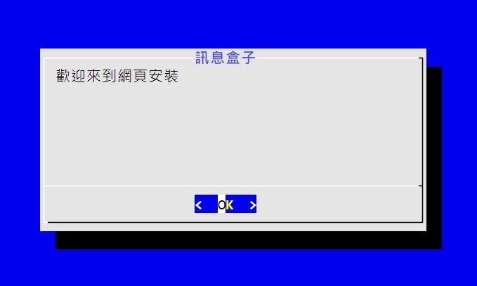
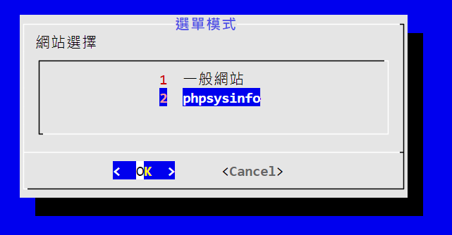
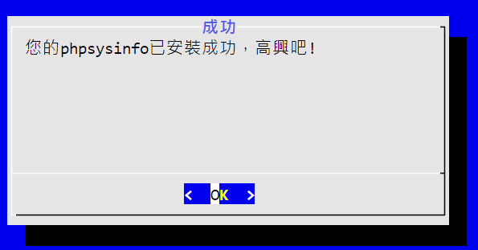
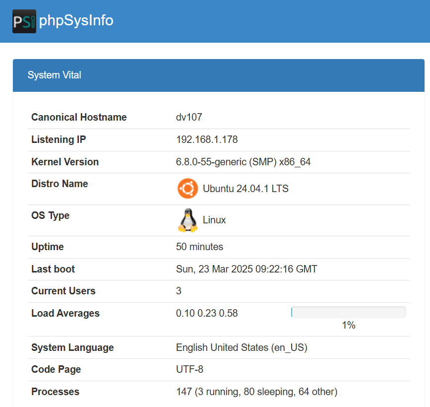

## my_product：

本程式為**提供網站架設**之TUI介面，
本TUI提供兩種網站架設：
1. HTML模板(三種)
2. phpsysinfo

架設完畢之後，會用curl指令進行檢查，
確認無誤，即架設成功。

### 主要程式

主要執行程式，dialog介面。
```
main.sh
```

### 副程式

須放在同一路徑下，由main.sh執行。
```
# HTML安裝程式(不同模板)：
1. install_cafe.sh
2. install_school.sh
3. install_chocolux.sh

# Phpsysinfo安裝程式：
installphpinfo.sh
```

### 額外檔案/程式
```
# 用於網站測試之檔案
curl.txt 

# 用於刪除用途，不使用在main.sh
removeapache.sh
removephpinfo.sh
```

### 操作指南

1. 賦予 main 資料夾的所有 .sh 檔案**執行權限**。
```
chmod +x *.sh
```
2. 安裝dialog、unzip套件。
```
sudo apt install dialog unzip
```
3. 啟動主程式。
```
./main.sh
```

### 畫面呈現：

1. 初始頁面<br>

2. 網頁選單<br>

3. 安裝成功畫面<br>

4. 頁面顯示（在瀏覽器輸入IP）<br>
