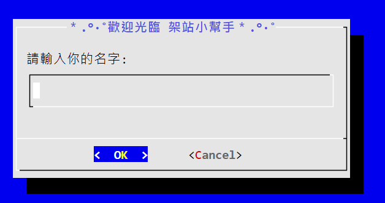
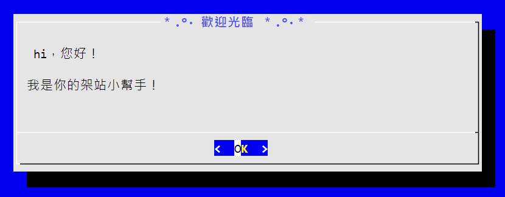
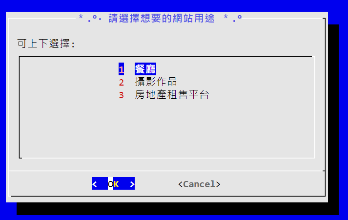
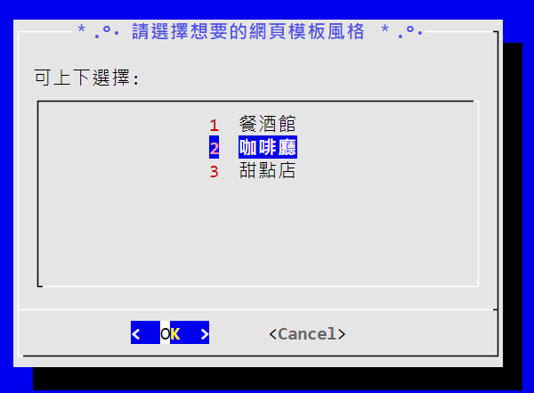
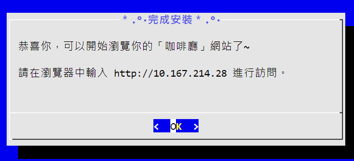
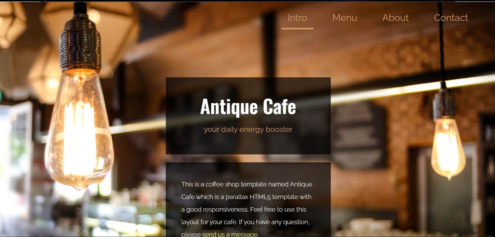
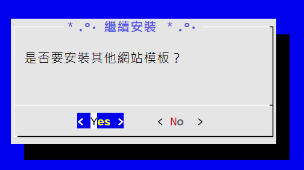
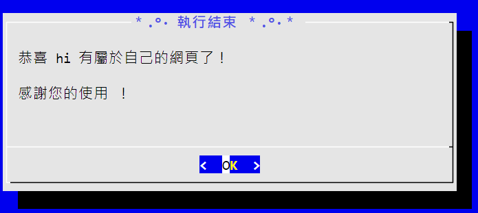

# 小組成員

Claire、Kelly、Dino、Sophia、Joelle、Amy

# Apache 網站安裝工具

這是一個基於 dialog 的互動式網站安裝工具，可以讓使用者快速安裝並客製化 Apache 網站。

## 功能特色

1. 互動式操作界面
2. 三種網站用途選擇：
  - 餐廳
  - 攝影作品
  - 房地產租售平台
3. 每個用途都有三個風格可以選擇
  - 餐廳：(1)餐酒館  (2)咖啡廳  (3)甜點店
  - 攝影作品：(1)婚紗攝影集  (2)食物影像紀錄  (3)攝影集網站設計
  - 房地產租售平台：(1)極簡專業  (2)商業高端  (3)年輕親民
4. 支援網站標題客製化
5. 即時進度顯示
6. 完整的安裝與移除功能

## 檔案說明

- `mydialog.sh`: 主程式入口，處理使用者名稱與網站標題輸入
- `choices.sh`: 網站風格選擇介面
- `installapache.sh`: 網站安裝腳本
- `htmls.conf`:網站安裝檔案變數處理
- `removeapache.sh`: Apache 移除工具

## 使用方式

1. 確保系統已安裝 dialog、unzip：
   ```bash
   sudo apt install dialog
   sudo apt install unzip
   ```

2. 賦予執行權限：
   ```bash
   chmod +x *.sh
   ```

3. 執行主程式：
   ```bash
   ./mydialog.sh
   ```

4. 依照提示輸入：
   - 使用者名稱
   - 自訂網站標題

5. 選擇喜愛的網站風格

6. 等待安裝完成

## 移除方式

如果要移除網站，執行：
```bash
./removeapache.sh
```

## 系統需求

- Ubuntu/Debian 作業系統
- dialog 套件
- Apache2
- 網路連線（用於下載模板）

## 注意事項

1. 需要 root 權限安裝 Apache
2. 會覆蓋 /var/www/html 目錄下的檔案
3. 請確保有穩定的網路連線

## 畫面呈現

1. 初始頁面 - 輸入名字<br>

2. 開始頁面<br>

3. 選單 - 選擇用途<br>

4. 選單 - 選擇樣式<br>

5. 安裝成功畫面<br>

6. 頁面顯示（在瀏覽器輸入IP）<br>

7. 選擇其他網頁（點擊yes，移除原本網頁）<br>

8. 結束頁面<br>
